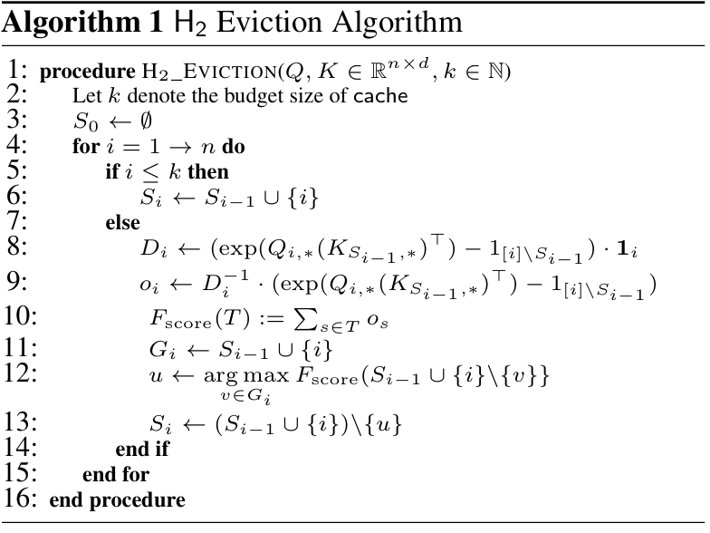
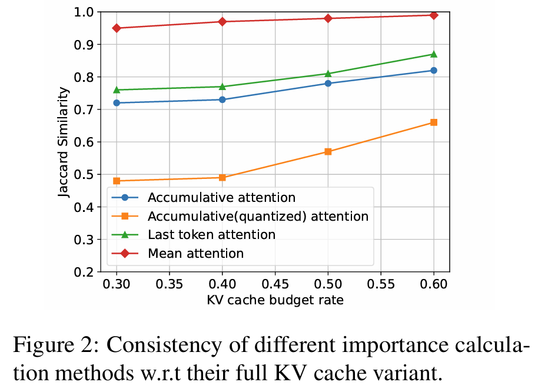
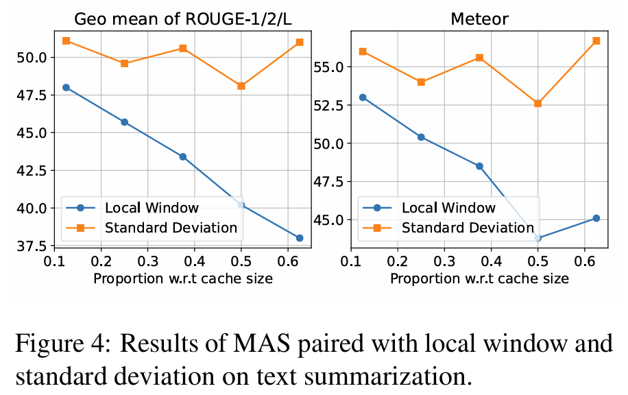
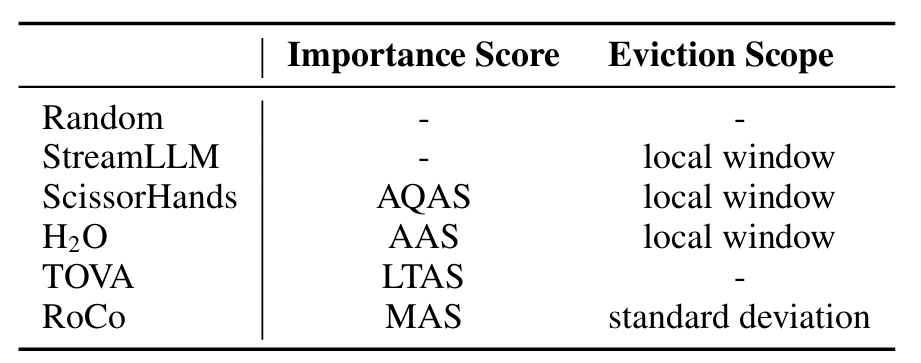
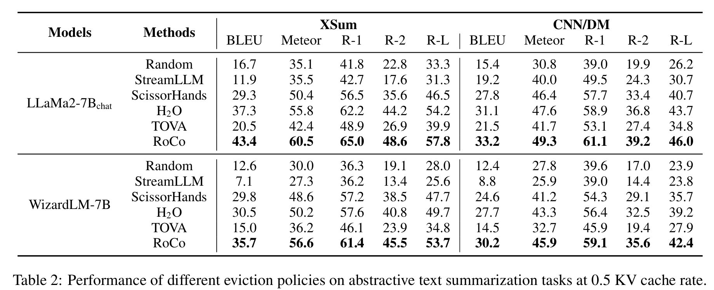
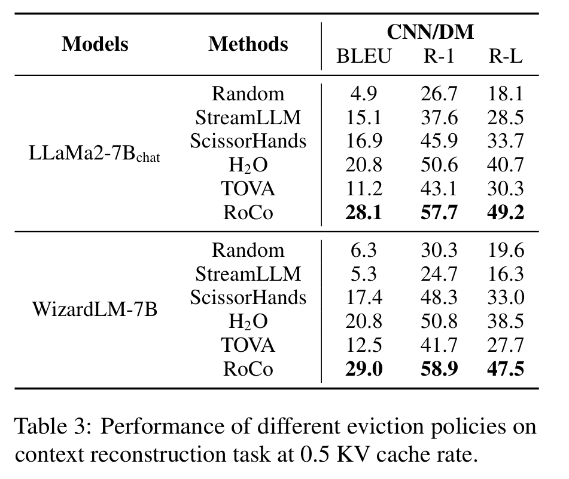
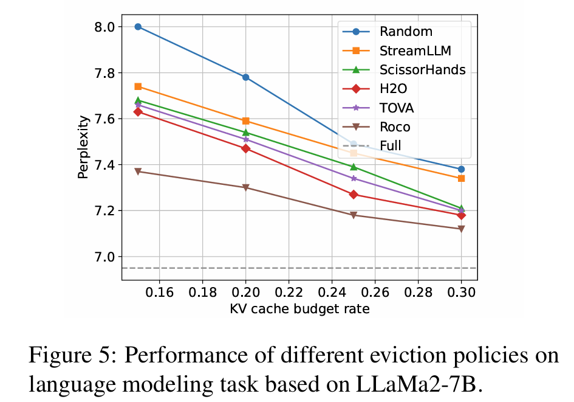

<!-- 主要干这些事：
1. 整理论文的实验部分，包括 benchmark，dataset，baseline 之类的
2. 根据 readme 搭建环境，跑一下里面的 test 或 example
3. 可以阅读代码梳理一下代码的 workflow -->
# EasyKV 曹备权
- Paper: [On the Efficacy of Eviction Policy for Key-Value Constrained Generative Language Model Inference](https://arxiv.org/pdf/2402.06262.pdf)
- Implementation: [DRSY/EasyKV](https://github.com/DRSY/EasyKV)
## Insights
- Fundamental Idea: KV cache only needs to retain **heavy-hitters** and **recent KV embeddings**
- Questions: how to evaluate *heavy-hitters* and define *recent* ?
## Method
> "We represent an eviction policy as the composition of two components: importance score calculation and eviction scope construction."
### Importance Score Calculation
- *Accumulative Attention Score (AAS)* :
- *Mean Attention Score (MHA)* : MAS ==divides each token’s accumulative attention score by how many times that token is attended by future tokens.== 
- Preliminary Experiment:(top B most important tokens compared with full cache)
- 
### Eviction Scope
>Phenomenon: The standard deviation of the attention probabilities a tken receives from future tokens typically undergoes a brief ascending phase before settling into a stable decline, regardless of the model layer and attention head. 
- Method :exclude tokens having top-r ==standard deviation== from eviction scope
- 
## Experiment
Compare the performance of various combinations of methods under differrent tasks
### Benchmark
|tasks | metrics|
|------|------|
|Language Modeling|perplexity|
| Abstractive Text Summarization|ROUGE and METEOR |
|Original Context Reconstruction| BLEU and ROUGE|
| Instruction Following|BLEU and ROUGE|
> - Language Modeling: capacity to generate coherent texts
> - Abstractive Text Summarization: evaluate the capacity of input compression
> - Instruction Following: evaluate the auto-decoding performance
### Dataset
-   OpenWebText
-   XSum
-   CNN/Daily Mail
-   AlpacaEval
### LM
-  LLaMa2-7B-base
-  LLaMa2-7B-Chat
-  WizardLM-7B 
### Baseline

### Results
- 
- 
- 
- Passkey Petrieval (not in the paper)
  - #Tokens of Prompt: 5144 Passkey target: 89427
[What is the pass key? The pass key is 89427.]
  - #Tokens of Prompt: 5144 Passkey target: 51906
[What is the pass key? The pass key is 51906.]
  - #Tokens of Prompt: 5144 Passkey target: 38117
 [What is the pass key? The pass key is 38117.]
  - #Tokens of Prompt: 5144 Passkey target: 60151
[What is the pass key? The pass key is 60151.]
  - #Tokens of Prompt: 5144 Passkey target: 23789
[What is the pass key? The pass key is 23789.]

## Further work
- [ ] more experiment to figure out **the boundary of cache budget rate** for satisfactory output
- [ ] a deeper study of the code to understand the workflow 
