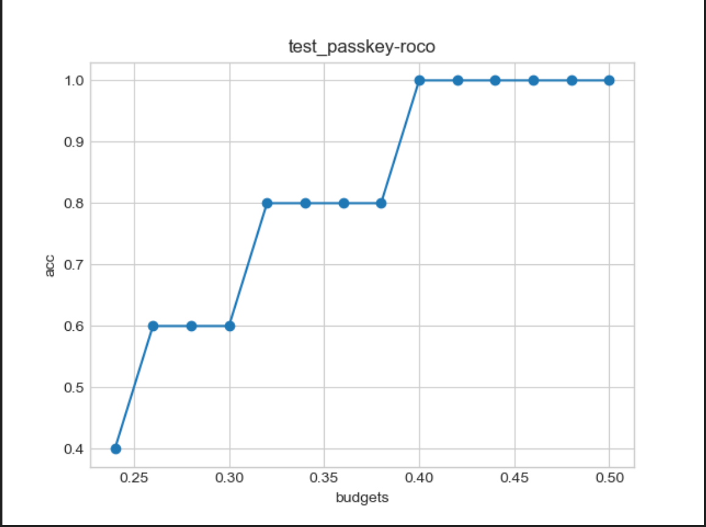
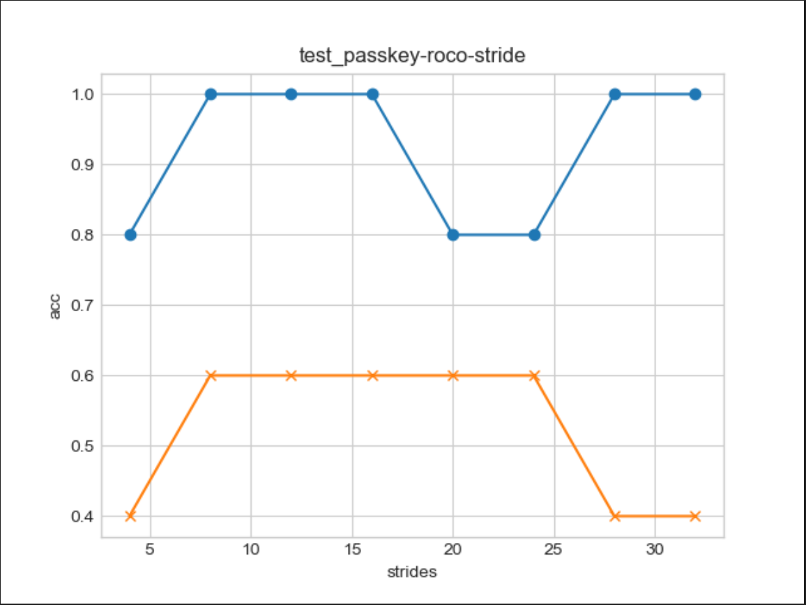

# New PassKey 曹备权
## Code Structure
- llama patch
```python
def llama_forward(
    self,
    hidden_states: torch.Tensor,
    attention_mask: Optional[torch.Tensor] = None,
    position_ids: Optional[torch.LongTensor] = None,
    past_key_value: Optional[Cache] = None,
    output_attentions: bool = False,
    use_cache: bool = False,
    attn_device = 'cuda',
    **kwargs,
) -> Tuple[torch.Tensor, Optional[torch.Tensor], Optional[Tuple[torch.Tensor]]]:
```
- generate function
```python
model.easykv_generate = functools.partial(generate, self=model, kv_mode=mode, stride=stride, report_decoding_latency=verbose)
```
- eviction
```python
elif mode in ['roco']:
      cur_std = torch.sqrt(cache_attn_scores_square / cache_counter - (cache_attn_scores / cache_counter)**2)
      cur_std[:, :, -10:] = 1e9
      cur_std[:, :, :sink_length] = 1e9
      _, feasible_ids = torch.topk(cur_std, largest=False, k=max(budget-recent_window-sink_length, stride), dim=-1) # (layers, heads, k)
      argmin_id = torch.topk(cache_attn_scores.gather(dim=-1, index=feasible_ids) / cache_counter.gather(dim=-1, index=feasible_ids), dim=-1, largest=False, k=stride)[1] # (layers, heads)
      eviction_ids = feasible_ids.gather(dim=-1, index=argmin_id)
      past_key_values = truncate_kv_cache_liso(past_key_values, eviction_ids)
      _index = torch.ones(num_layers, num_heads, cache_attn_scores.shape[-1], device=self.device).view(num_layers*num_heads, -1)
      _src = torch.zeros(num_layers, num_heads, stride, device=self.device).view(num_layers*num_heads, -1)
      mask = _index.scatter(dim=-1, index=eviction_ids.view(num_layers*num_heads, -1), src=_src).bool()
      cache_attn_scores = torch.cat((cache_attn_scores.view(-1, cache_attn_scores.shape[-1])[mask].view(num_layers, num_heads, -1), torch.zeros(num_layers, num_heads, stride, device=self.device)), dim=-1)
      cache_attn_scores_square = torch.cat((cache_attn_scores_square.view(-1, cache_attn_scores_square.shape[-1])[mask].view(num_layers, num_heads, -1), torch.zeros(num_layers, num_heads, stride, device=self.device)), dim=-1)
      cache_counter = torch.cat((cache_counter.view(-1, cache_counter.shape[-1])[mask].view(num_layers, num_heads, -1), (torch.arange(stride)-stride+1).view(1, 1, -1).repeat(num_layers, num_heads, 1).flip(dims=(2,)).to(self.device)), dim=-1)
```
## Preliminary Experiment
- 
> The accuracy of passkey retrieval decreases gradually with the cut in budget, which could be compared to the human's memory. It's trivial that if one has to anwser questions after reading an article, those with better memory is more likely to give more satisfactory response. Similarly, those with wise reading pace perform better. And we may compare the **stride** to the reading pace. Since the stride determines the number of tokens we choose to evict at one time, in some sense, it sounds like reading pace.
- 
- The blue line above represents the case with 0.38 budget. As is shown by the figure, we could further lower the compression budget by smartly choosing the stride.
## Insight
- The process of eviction introduces 2 parts of extra cost: one is the update of attention cache, the other is the selection of the evicted tokens. With a larger stride, both 2 parts could be accelerated.
- However, if the stride is excessively large, the model would read too fast to memorize important information. Also, the stride should not be too short, or the model would fail to capture longer interdependecy. So there is a trade-off.
- An intuitive idea is that the reading pace should be dynamic, which means the model should skim through(large stride) the part of the article it thinks is easy to understand, while it carefully reads(short stride) the part it thinks is obscure.The compexity of the currently-read context can be measured by some particular analysis of the attention cache
