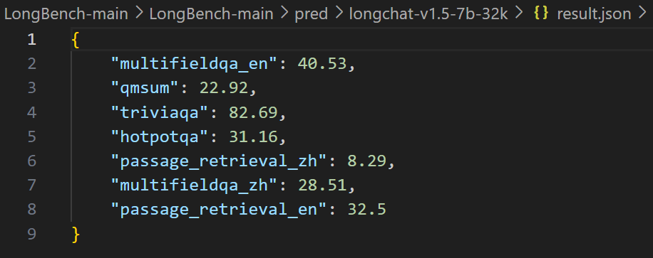

# LongBench 曹备权
- Paper: [LONGBENCH: A BILINGUAL, MULTITASK BENCH
MARK FOR LONG CONTEXT UNDERSTANDING](https://arxiv.org/pdf/2308.14508.pdf)
- Implementation: [LongBench](https://github.com/THUDM/LongBench/blob/main/)

## Advantage
- diversity of tasks

- automatic evaluation
- bilingual

## Results

### Analysis
- large gap between open-sourced models and commercial models
- Models benefit from scaled positional embedding and continued training on longer context
- summarization and code completion tend not to be sufficiently discerning, while synthetic tasks tend to offer a higher level of discernment
- truncation tests

- trend with context length increasing

- correlation between tasks

### Compression Methods
- Retrieval: Given a long context, we first split it into chunks with a default size of M words (or characters on Chinese datasets), then use a specific retriever to compute the embedding of the text chunks and the query, and concatenate only the top-N chunks according to the cosine similarity of their embeddings to the query embedding. The top-N chunks as the compressed context, together with the query, are then fed into the model to produce an answer.

 
- Summary: Specifically, we first utilize the model to generate a brief summary for each text chunk, and concatenate the summaries together as the compressed context.

## Experiment
- deploy the Longchat-v1.5-7b-32k and datasets on the server
- establish the environment(ninja flash_attn, fast_chat)
- modify the pred.py and run

- run LongBench on the Longchat-v1.5-7b-32k with easyKV (fixed budget 1024 tokens)

