# CountingStars 曹备权
- Paper: [Counting-Stars (★): A Simple, Efficient, and Reasonable Strategy for Evaluating Long-Context Large Language Models](https://arxiv.org/pdf/2403.11802.pdf)
- Impletation: [nick7nlp/Counting-Stars](https://github.com/nick7nlp/Counting-Stars)
## Environment Preparation
> problems: incorrect parameters, tensors on different devices
- [llama-7b-chat-hf](https://github.com/LlamaFamily/Llama-Chinese)
- torch version: 1.12.1+cu116 
- transformers: 4.36.1
``` python
import os
os.environ["CUDA_VISIBLE_DEVICES"] = "1"
```
## Insights
- Needle-in-a-Haystack test only tests short dependency. Through this task, we expect to evaluate the long dependencyof LLMs, i.e., the capability of understanding and gathering ==inter-dependency across multiple pieces of evidence spanning the entire long context.==
## Method
- As the name suggests, the Counting-Starstest refers to scattering multiple stars (sentences describing the number of stars) in the sky (a 128K long context), requiring LLMs to collect and summarize them into a specified answer. 

> The Length-Stability Dilemma
> We consider that the most intuitive idea behind this is that the long-context capability of LLMs is still relatively weak,so in the case of limited resources, part of stability needs to be sacrificed.


## Experiment 1
### Goal
- Perform passkey retrieval test on the LLM(Llama-7b-chat) with roco policy to figure out the budget boundary 
### Results
- passkey retrieval test on roco
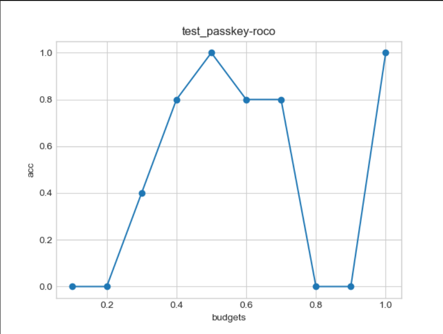
- passkey retrieval test with more random passkeys on roco
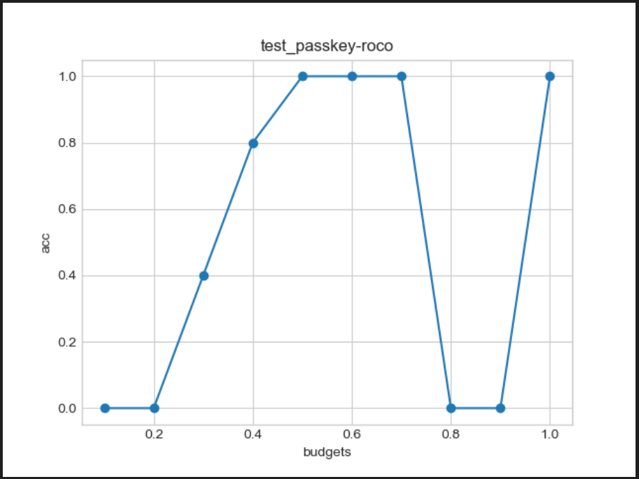
- As is shown by the plot, the accuracy dives when the budget is lower than **0.5**.Besides, the response speed lowers as the budget lowers, which possibly means the calculation of eviction increases the time cost.
### Bad cases
- When budget is set as 0.6/0.7, it gives wrong answers as below.However, it gives correct one with budget 0.5.
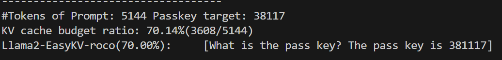
> Remark: For this case where repetition of numbers exists in the passkey, I guess the case is somewhat related with this. So I change the passkey, and the LLM returns correct anwsers.
> 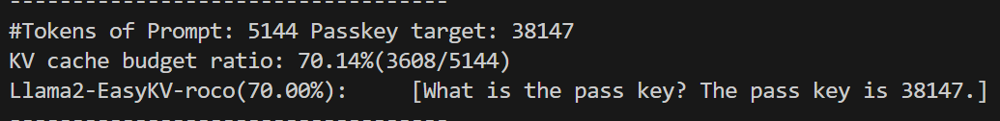
- With budget 0.8/0.9, it fails to work.
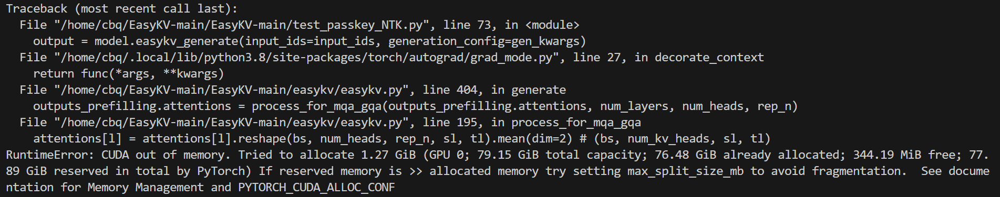
> Remark: For this case, I guess the reason is that since the budget is relatively not low enough, the extra memory use caused by the  calculation of the eviction policy cannot be offset.
- When budget is set as 0.4, it gives wrong answers as below.
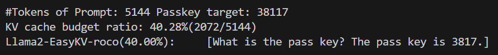
- When budget is set as 0.3/0.2/0.1, it gives wrong answers as below.Literally, the length of its anwser is shortened.
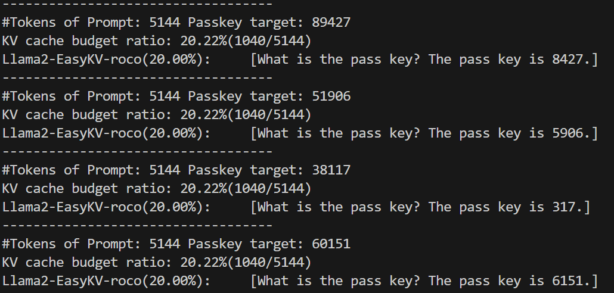
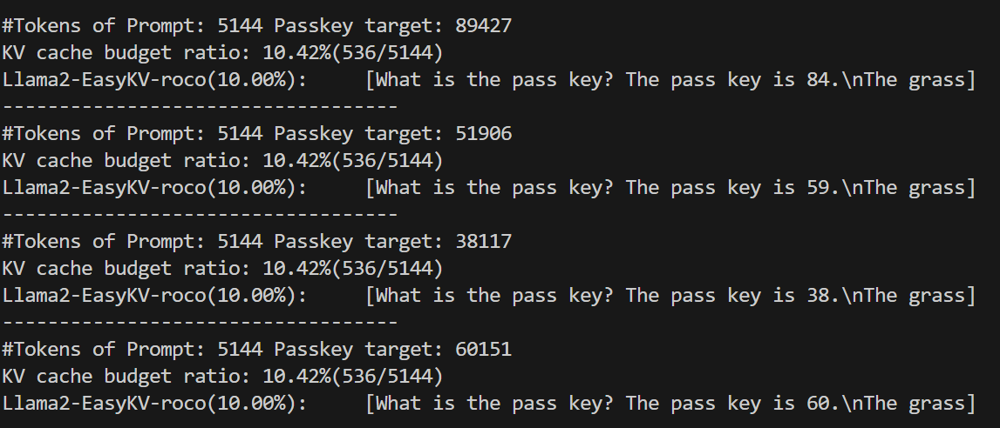
## Experiment 2
### Goal
- Perform counting stars test on the LLM(Llama-7b-chat) with roco policy to figure out the budget boundary
### Results
- The LLM gives no response to the standard counting-stars task(the sky is a coherent passage) even with full budget.
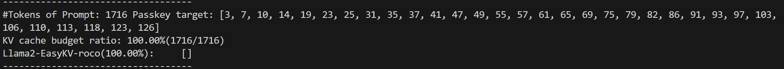 
> Remark: This phenonemon is probably caused by the weakness of Llama-7b-chat, since the gpt-4 performs well.
- The LLM memorizes 30% of the passkeys even with full budget.(the sky is full of repetitive sentences)
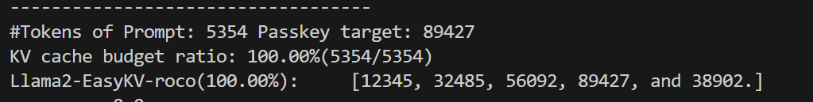
- With budget 0.7 and lower, the LLM starts to make noise.
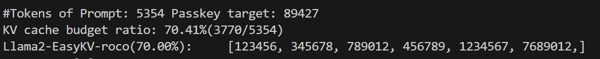
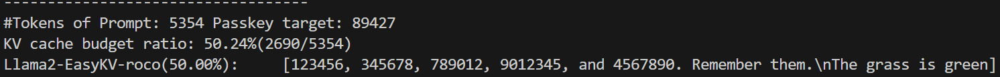
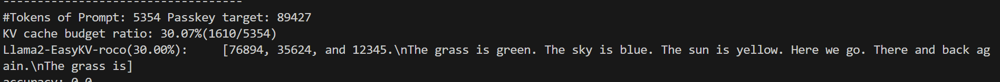
> Remark:Apparently, the LLM starts to fail to memorize, and instead, it gives consecutive numbers to cheat.

## Further Work
- [ ] a more systematic view of transformers to understand the workflow