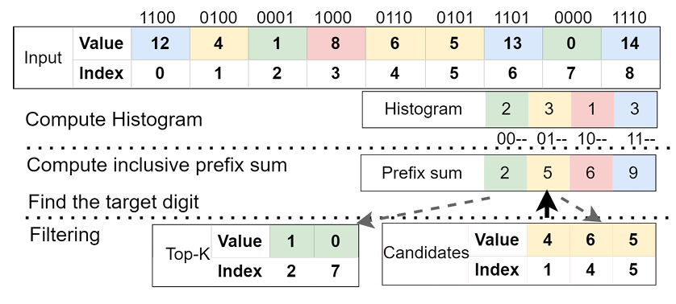
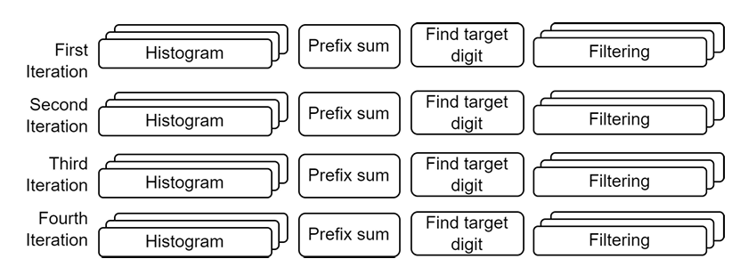
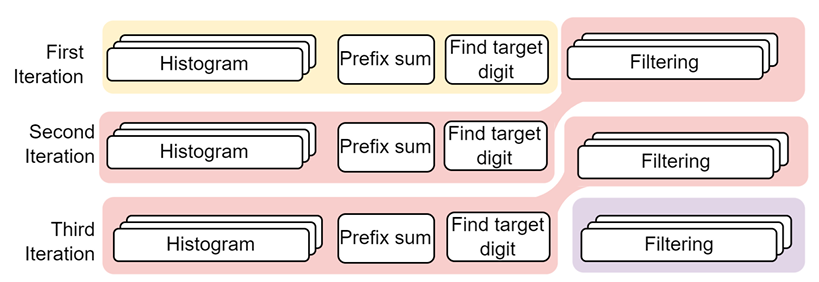
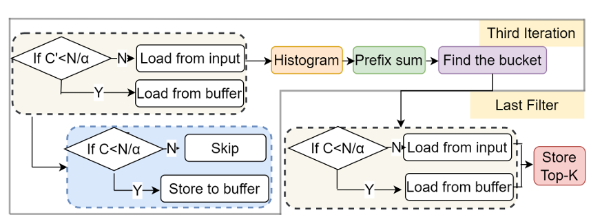
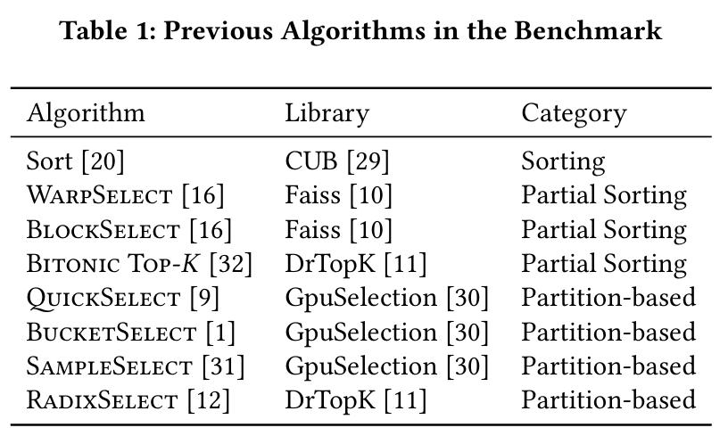
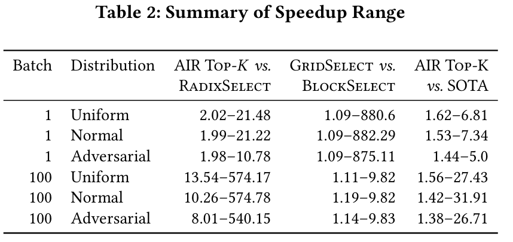
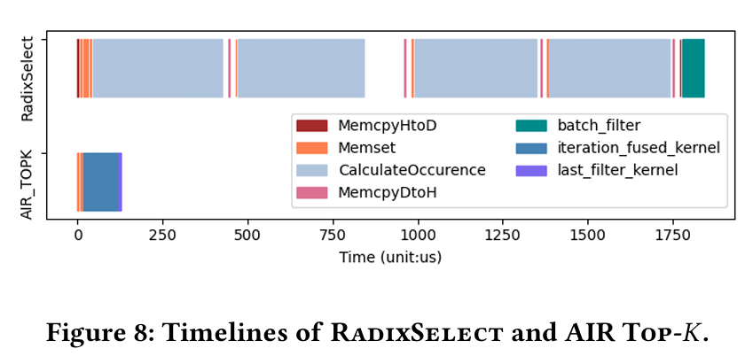
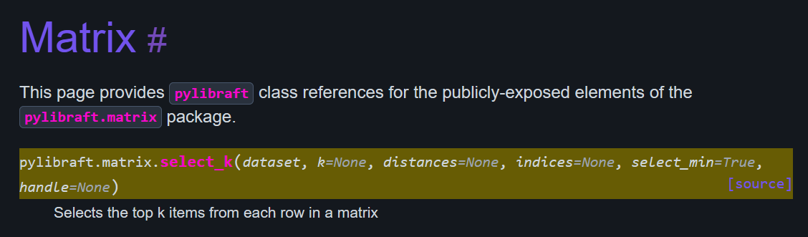

# topk 曹备权
- Paper: [Parallel Top-K Algorithms on GPU: A Comprehensive Study and New Methods](https://dl.acm.org/doi/pdf/10.1145/3581784.3607062)
- Implementation: [RAFT](https://docs.rapids.ai/api/raft/stable/pylibraft_api/matrix/#pylibraft.matrix.select_k)

## Algorithm
1. Compute histogram
2. Compute inclusive prefix sum of the histogram
3. Find target digit
4. Filtering

### Iteration-fused Design
> By viewing all iterations as a whole, we find that the filtering
 for the current iteration and histogram computation for the next
 iteration can be done within the same kernel. The benefits are not
 only reducing the number of kernel calls but also decreasing the size
 of device memory loading. During the filtering, if an element is a
 candidate for the next iteration, we immediately extract the needed
 bits from it, transform bits to a digit, and increase the corresponding
 counter in the histogram.

### Adaptive Strategy Based on Data Distribution

### Early Stopping

## Evaluation

## API
